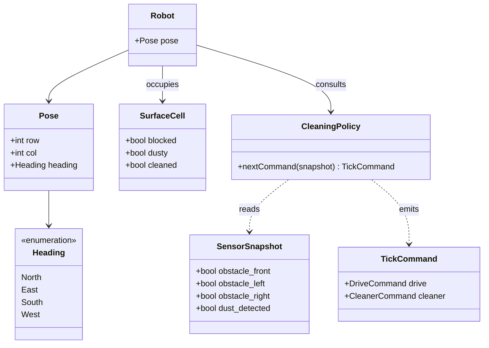

# Domain Model — RVC Cleaning

도메인 모델은 하드웨어 세부가 아니라 **청소 행위와 공간 관계**를 표현한다.

## 개념 클래스 (Mermaid)

## 책임 메모

- **CleaningPolicy**: FR-002~FR-004를 코드 레벨 결정으로 바꾼 개념적 표현. 구현 클래스는 `CleaningCoordinator`.
- **SurfaceCell**: 시뮬레이션 세계의 타일 속성. 실행 코드에서는 `GridWorld`가 문자 맵과 방문 청소 플래그로 표현한다.
