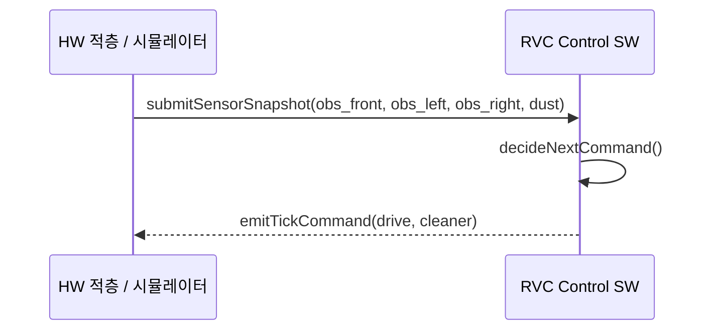
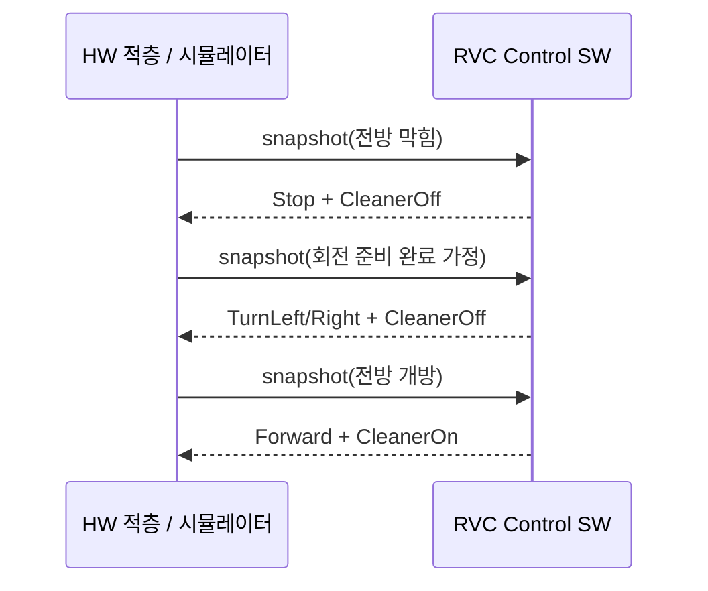

# System Sequence Diagrams (SSD)

시스템(System)은 **RVC Control SW** 블랙박스로 본다.

## SSD-01 `tick()` — 센서 입력과 명령 출력

## SSD-02 회피 시퀀스(요약)

실제 구현은 한 틱에 하나의 `TickCommand`를 출력하며, SSD의 다중 메시지는 **여러 틱에 걸친 상호작용**으로 이해한다.
