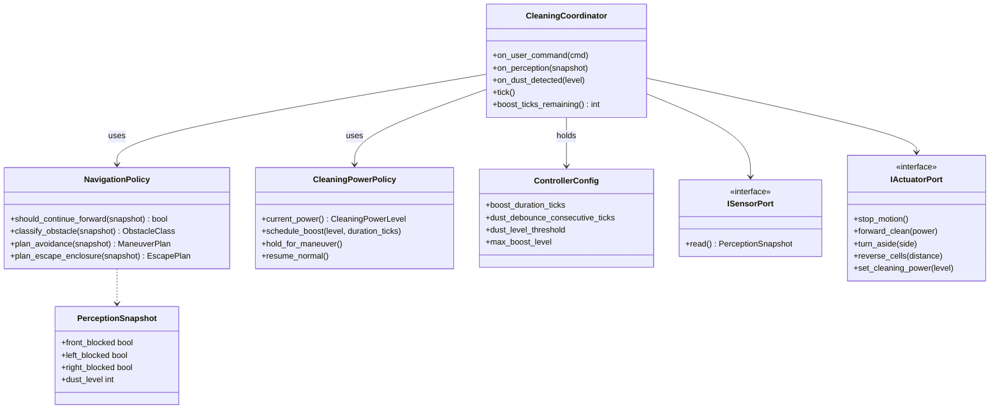

# 설계 클래스 다이어그램 (DCD) — RVC SW Controller

## 개요

C++ 구현 식별자(**snake_case**)와 문서 Mermaid는 **역할 동일 시 추적 가능**하다.  
SSD/DCD 연산명과의 1:1 문자열 매핑은 **`implementation-mapping.md`** 를 규준으로 한다.

## Mermaid classDiagram (개념 + C++ 주석)

## 인터페이스·구현 관계

- `ISensorPort` / `IActuatorPort`: 구체 구현은 그리드 시뮬 (`GridSensor`, `GridActuator`) 또는 향후 HAL.
- `CleaningCoordinator`: UC-001~005 **오케스트레이션**; 입력은 **`tick()` + 선택적 푸시** (`on_perception` / `on_dust_detected`).

## SOLID 점검 메모

- **SRP**: 파워 타이머·레벨 클램프는 `CleaningPowerPolicy`; 회피 규칙은 `NavigationPolicy`; 튜닝 상수는 `ControllerConfig`.
- **DIP**: Coordinator는 Port 추상에만 의존.

## 타입·연산과 시퀀스 정합

| Interaction 파일 | 주 메시지 (구현) |
|------------------|------------------|
| UC-001 | `on_user_command` |
| UC-002 | `should_continue_forward`, `current_power`, `forward_clean`, `set_cleaning_power` |
| UC-003 | `classify_obstacle`, `plan_avoidance`, `stop_motion`, `turn_aside` |
| UC-004 | `plan_escape_enclosure`, `reverse_cells`, `turn_aside` |
| UC-005 | `schedule_boost`, `set_cleaning_power`, `ControllerConfig` |
