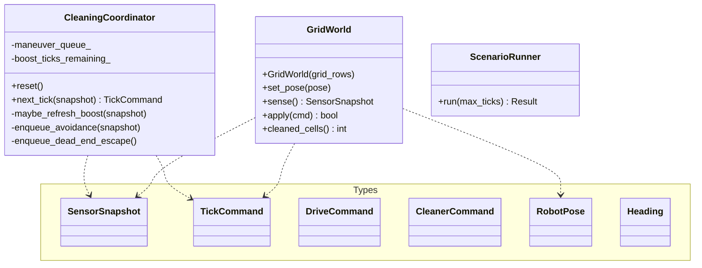

# Class Diagram — 구현 뷰

## 핵심 타입

## 패키징(물리 모듈)

- `include/rvc/types.hpp` — 공용 열거형·구조체
- `include/rvc/cleaning_coordinator.hpp`
- `include/rvc/grid_world.hpp`
- `src/rvc/cleaning_coordinator.cpp`
- `src/rvc/grid_world.cpp`
- `apps/rvc_sim.cpp` — 시나리오 로더 + 실행 루프
