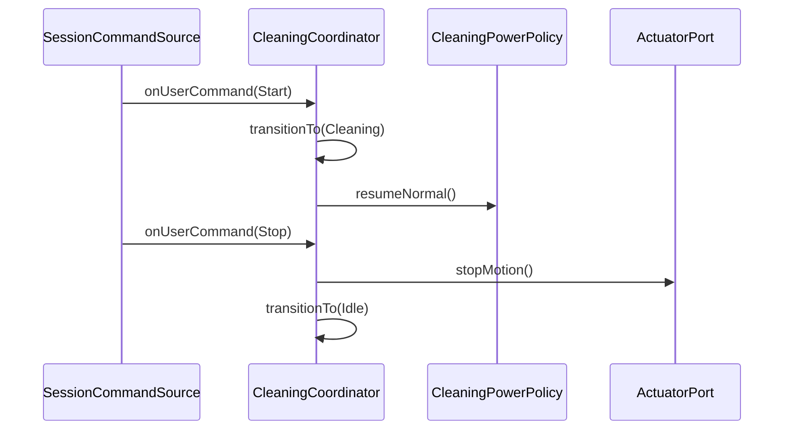

# Interaction: UC-001 — *Control automatic cleaning session* (OOD)

`UC-001` Typical: 사용자 **Start** → 세션 **Cleaning**; **Stop** → **Idle**·안전 정지.

## 시퀀스

## 메모

- **Controller**: 세션 상태 전이는 `CleaningCoordinator`(커지면 `CleaningSessionService` 분리로 SRP 강화 가능).
- **Exceptional** (UC-001과 연계): 오류·센서 실패 시 Idle 전이는 정책·NFR에서 구체화.
