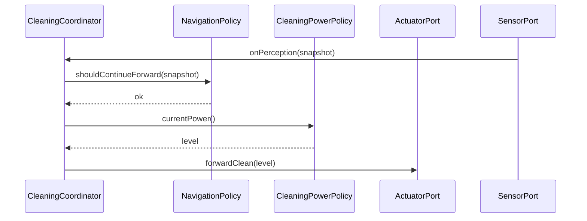

# Interaction: UC-002 — *Forward cleaning while session active* (OOD, 틱 1회)

## 맥락·선행 조건

- `UC-002` Pre-Requisites: 세션 **Cleaning**, **삼면막힘 아님**(UC-004 아님).
- 이번 틱에서 **부분 장애**(UC-003)·**삼면 탈출**(UC-004)이 **선행하지 않음**. 먼지 부스트(UC-002 A1)는 **파워만** `CleaningPowerPolicy` 경유(시퀀스는 단순화).

## 시퀀스

## 메모

- **NavigationPolicy**는 스냅샷으로 “전진 유지 가능”만 판단; 실제 UC-003/004 분기는 Coordinator가 **우선순위**(삼면 → 부분 → 부스트)로 라우팅한다.
- `UC-002` **E3** 센서 모순: Coordinator가 정지·재평가(구현 정책).
