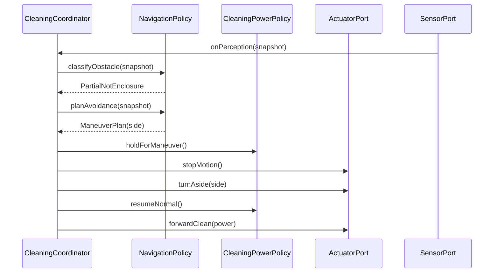

# Interaction: UC-003 — *Avoid obstacle when partially blocked* (OOD)

## 맥락·선행 조건

- SSD `ssd/UC-003-main-success.md`와 `UC-003` Typical 1–5 정합.
- **삼면 막힘 아님**은 Coordinator 또는 `NavigationPolicy`의 선행 판단(`UC-003` 이벤트 2).
- **GRASP Controller**: `CleaningCoordinator`.
- **Expert**: `NavigationPolicy` — 부분 장애 시 **측면 선택**(UC-003 A1 규칙).

## 시퀀스

## GRASP / 가시성 메모

- **Controller**: `CleaningCoordinator` — 정지→회피→재전진 순서.
- **Expert**: `NavigationPolicy` — `classifyObstacle`·`planAvoidance`(동일 타입 내 응집 가능). 전방 막힘 시 **왼쪽만 통로 → 좌**, **오른쪽만 → 우**, **양쪽 → 좌** 우선.
- **DIP**: `SensorPort`, `ActuatorPort` 추상 — GTest 더블.
- **A2 / E***: 연속 장애·공간 부족 시 UC-004 또는 안전 정지 — Coordinator 정책.

## DCD

- `arch/design/class-diagram.md`의 `CleaningCoordinator`, `NavigationPolicy`, `CleaningPowerPolicy`, Port 타입과 연산명 정합.
