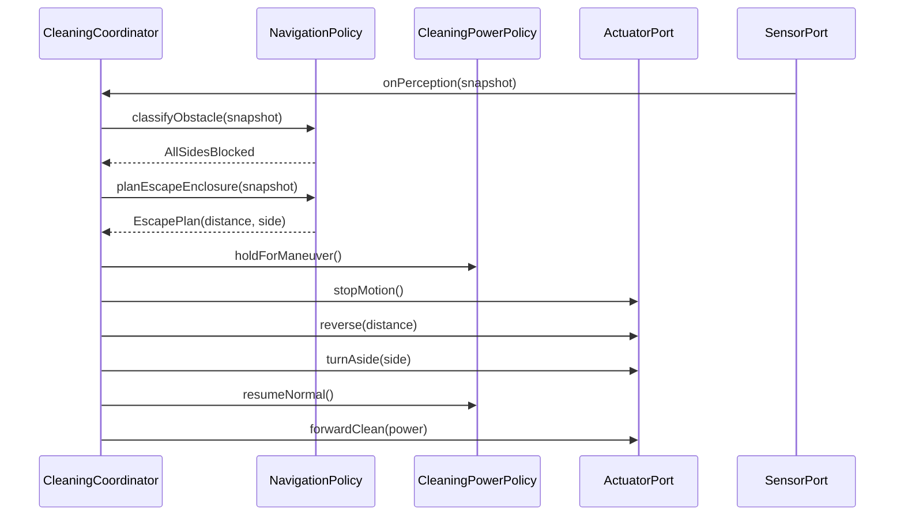

# Interaction: UC-004 — *Escape when front, left, and right are blocked* (OOD)

## 맥락·선행 조건

- SSD `ssd/UC-004-main-success.md`와 `UC-004` Typical 1–5 정합.
- **E1** 후방 안전: `system.md` 범위·보수적 후진 거리는 정책 파라미터.

## 시퀀스

## GRASP / 메모

- **Expert**: `NavigationPolicy` — 삼면 판별·후진·측면 선택·`UC-004` A1/A2 변형은 동일 Expert 내 규칙.
- **E2** 탈출 한도: Coordinator가 반복 카운트·타임아웃 후 Idle 등.

## DCD

- `NavigationPolicy`: `classifyObstacle`, `planEscapeEnclosure(snapshot)` — `arch/design/class-diagram.md`.
