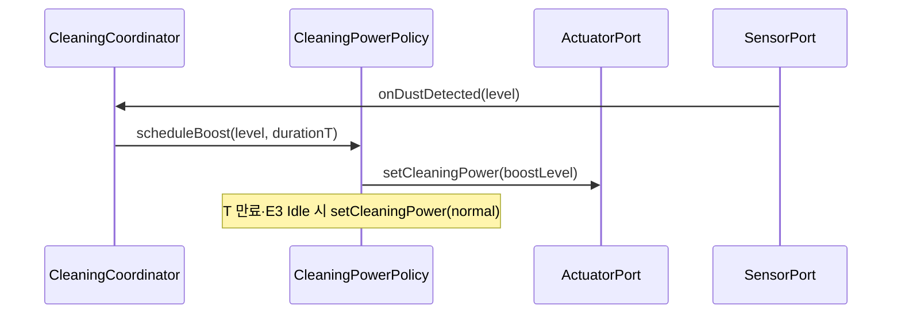

# Interaction: UC-005 — *Boost cleaning power on dust detection* (OOD)

구현 식별자·SSD 연산 매핑: **`arch/design/implementation-mapping.md`**.

## 맥락·선행 조건

- SSD `ssd/UC-005-main-success.md`와 `UC-005` Typical 1–4 정합.
- **A2**: 동일 틱에 회피(UC-003/004)가 있으면 Coordinator가 **회피 우선** — 부스트는 스케줄만 지연하거나 `CleaningPowerPolicy`가 **일시 억제**.

## 시퀀스

## GRASP / 메모

- **Expert**: `CleaningPowerPolicy` — 부스트 레벨·**T**·**A1** 연장, **E1** 디바운스, **E2** 클램프(SRP).
- Coordinator는 세션·우선순위만 orchestrate.

## DCD

- `CleaningPowerPolicy`: `scheduleBoost`, 타이머/`tick` — `class-diagram.md`.
