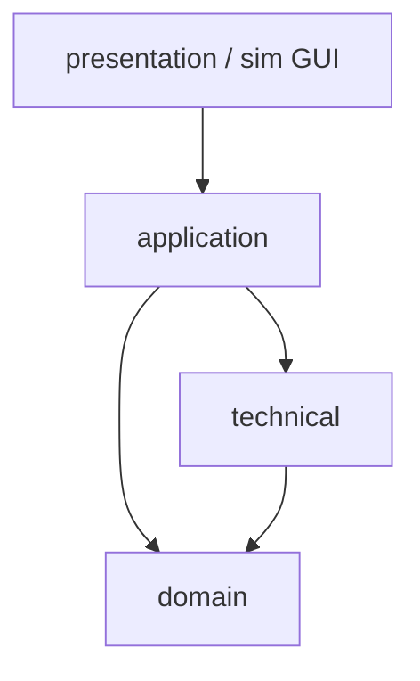

# 패키지 / 레이어 — RVC SW Controller

## 레이어 정의

| 레이어 | 책임 | 이 레이어가 의존 가능한 하위 레이어 |
|--------|------|--------------------------------------|
| **application** | 세션(UC-001), 루프 `tick`, UC 조율 — `CleaningCoordinator` | domain, technical |
| **domain** | 순수 정책 — `NavigationPolicy`, `CleaningPowerPolicy`, 값 객체 `PerceptionSnapshot`, Plan 타입 | (없음 또는 표준 라이브러리만) |
| **technical** | `SensorPort`/`ActuatorPort` **구현체**, 로깅, 타이머 어댑터 | domain(인터페이스 타입 정의는 domain에 둘지 technical에 둘지 팀 선택 — **권장: Port 인터페이스는 domain, 구현은 technical**) |
| **presentation** (선택) | 사용자/UI/시뮬레이터 버튼 → `UserCommand` 변환 | application |

## 금지 의존

- **domain** → application / presentation / 구체 technical **금지**
- **presentation** → domain 직접 **금지**(application 경유)

## SSD 연산 → 레이어

| 시스템 연산(요약) | 최초 처리 레이어 |
|-------------------|------------------|
| `startAutoCleaning` / `stopAutoCleaning` | application (`CleaningCoordinator` + 세션 상태) |
| `reportPerception` / 먼지·장애 이벤트 | technical → application 콜백 |
| `commandForwardClean` 등 | application → technical `ActuatorPort` |

## UC → 주 모듈 (요약)

| UC Name (요지) | application | domain |
|----------------|-------------|--------|
| UC-001 session | Coordinator 세션 전이 | — |
| UC-002 forward | Coordinator `tick` 기본 루프 | `NavigationPolicy.shouldContinueForward` |
| UC-003 partial avoid | Coordinator 회피 오케스트레이션 | `classifyObstacle`, `planAvoidance` |
| UC-004 3-side escape | 동일 | `planEscapeEnclosure(snapshot)` |
| UC-005 dust boost | Coordinator → Policy 위임 | `CleaningPowerPolicy.scheduleBoost` |

## 소스 / CMake 대응 (권장 예시)

| 레이어 | 디렉터리 예시 |
|--------|----------------|
| domain | `src/domain/` |
| application | `src/app/` |
| technical | `src/io/` 또는 `src/hal/` |
| presentation / sim | `src/ui/` 또는 시뮬 전용 타겟 |

## Mermaid

*Port 인터페이스: `include/rvc/ports.hpp` (`ISensorPort` / `IActuatorPort`). 구현은 `src/technical/` — **`arch/design/implementation-mapping.md`** 참고.*
