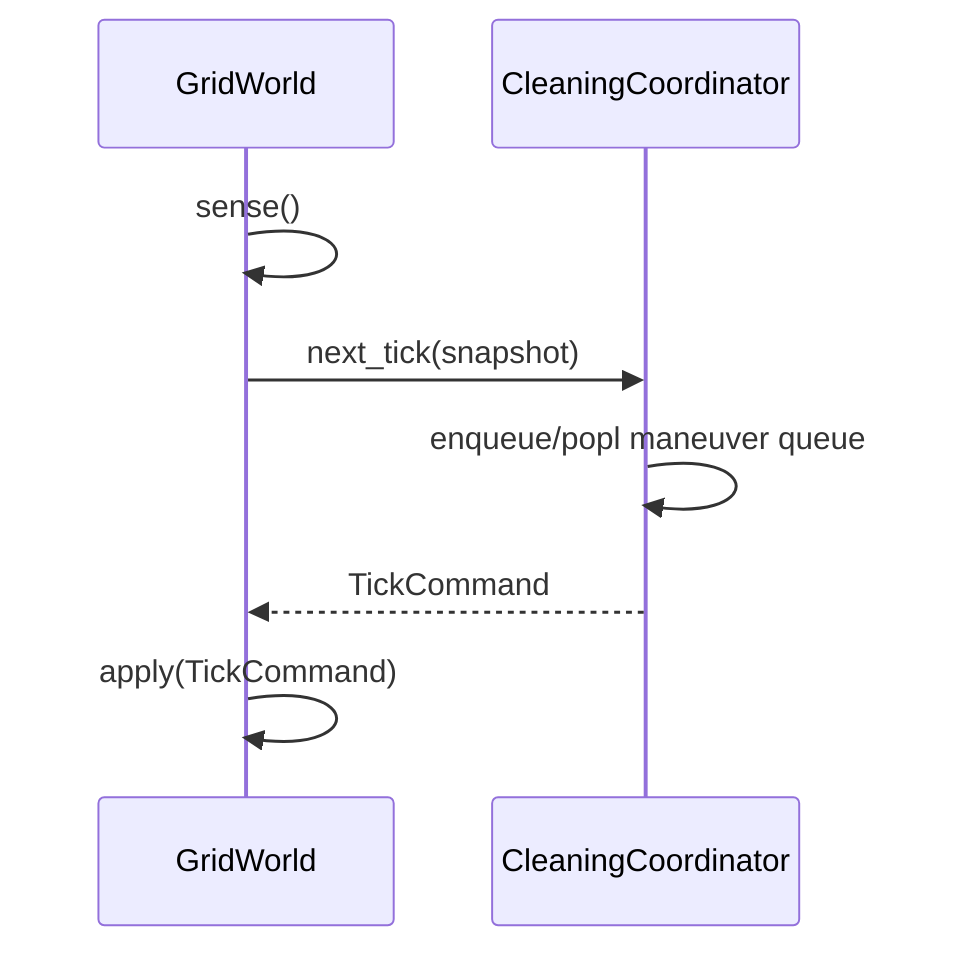

# Sequence Diagrams — CleaningCoordinator & GridWorld

## SD-01 한 틱의 협력



## SD-02 전방 장애물 분기

```mermaid
sequenceDiagram
  participant CC as CleaningCoordinator
  CC->>CC: frontBlocked?
  alt 좌측 개방
    CC->>CC: push Stop; TurnLeft; Forward
  else 우측만 개방
    CC->>CC: push Stop; TurnRight; Forward
  else 삼방향 막힘
    CC->>CC: push Backward×N; TurnLeft; Forward
  end
```
