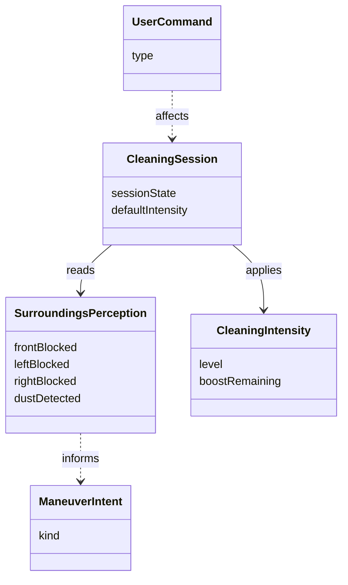

# 도메인 모델 (개념적) — RVC SW Controller

## 개요

자동 청소 정책을 논의할 **문제 영역 개념**. 구현 클래스·API는 DCD에서 정의.

## 개념 클래스

### CleaningSession

- 사용자가 시작한 **자동 청소 세션**. 생명주기: Idle ↔ Cleaning (및 필요 시 중간 상태).
- **속성(개념)**: 현재 세션 상태, 기본 청소 세기.

### SurroundingsPerception (또는 SensorReading)

- 센서가 제공하는 **주변 인식** 스냅샷: 전/좌/우 **장애 여부**, **먼지 여부**(또는 강도).
- HW 디테일 없음; **의미 있는 이벤트** 수준.

### ManeuverIntent (회피 의도)

- **좌 회피 / 우 회피 / 전진 / 후진 / 정지** 등 **기계적 의도**(개념). 실제 바퀴 각·속도는 비범위.

### CleaningIntensity

- 청소 **파워** 단계: 예) Normal, Boost. boost **유지 시간** 개념과 연결.

### UserCommand

- 사용자의 **시작·중지** 등 고수준 명령.

### CleaningTuning (구성)

- **`ControllerConfig`**: UC-005 의 **T**(틱), **E1 디바운스**, **E2 `max_boost_level` 클램프** — DCD의 값 객체 성격 (`include/rvc/controller_config.hpp`).

## 연관

- **UserCommand** — 세션에 영향 → **CleaningSession**
- **CleaningSession** — 진행 중 **SurroundingsPerception** 를 지속 참조
- **SurroundingsPerception** — **ManeuverIntent**·**CleaningIntensity** 결정의 입력
- **CleaningSession** — 현재 **CleaningIntensity** 유지

## UC Typical 흐름과 개념 매핑

| UC | Typical 단계와 연결되는 개념 |
|----|------------------------------|
| UC-001 | **UserCommand** → **CleaningSession** 생명주기(Idle/Cleaning) |
| UC-002 | **SurroundingsPerception** 수신 → **ManeuverIntent**(전진) + **CleaningIntensity**(기본; UC-005와 병행 시 Boost) |
| UC-003 | 부분 장애 인식 → 삼면 아님 확인 → **ManeuverIntent**(정지 → 측면 회피 → 전진) |
| UC-004 | 삼면 막힘 인식 → **ManeuverIntent**(정지 → 후진 → 측면 회피 → 전진) |
| UC-005 | 먼지 이벤트 → **CleaningIntensity**(레벨·**boostRemaining** / 유지 시간 T) |

## Mermaid (개념)

## UC별 초점 (선택 참고)

| UC | 도메인에서 다루는 초점 |
|----|------------------------|
| UC-001 | CleaningSession, UserCommand |
| UC-002 | ManeuverIntent(전진), CleaningIntensity(Normal) |
| UC-003 | SurroundingsPerception, ManeuverIntent(회피) |
| UC-004 | SurroundingsPerception(삼면), ManeuverIntent(후진+회피) |
| UC-005 | SurroundingsPerception(먼지), CleaningIntensity(Boost) |
