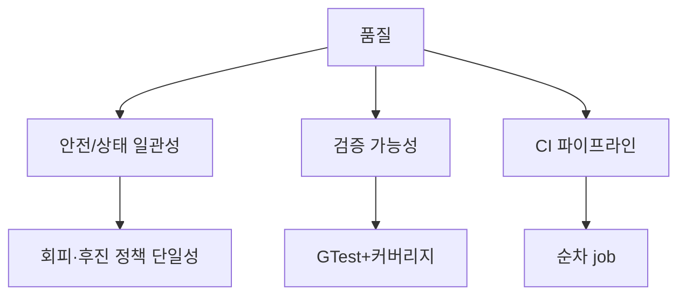

# 요구사항 (FR / NFR) — RVC SW Controller

근거: `arch/system.md`. HW 저수준 제어는 비범위.

## 프로젝트 필수 제약 (V&V·구현)

| 항목 | 내용 |
|------|------|
| 구현 언어 | **C++** |
| 단위/통합 테스트 | **Google Test**, **focal method** 기준 충분한 케이스, **stub/driver** 활용 |
| 커버리지 | 라인/브랜치(또는 팀 합의) **수치 목표** CI에서 측정 |
| 시스템 테스트 | **≥30**건, **positive/negative**, **GUI** 가시 확인(로컬), **GTest 아님** — 전략·산출물: **`arch/vnv/system-tests.md`** |
| CI/CD | **GitHub Actions**: **빌드 → 단위(GTest) → 통합(GTest) → 커버리지(lcov 수집, 게이트 필수 아님) → 시스템(비-GTest)** |
| 정적 분석 | **시스템 테스트 통과 후** 전체 코드 대상, 결과 **`reports/static-analysis/`** 보관 (수정 필수 아님) |
| 설계 | **OOAD + SOLID** (`arch/` 산출물과 코드 정합; 매핑 **`arch/design/implementation-mapping.md`**) |

검증: 위 제약은 `system.md`의 기능 요구와 **모순 없음** — 시스템 테스트·시뮬레이터가 자동 청소 **행동**을 검증하고, GTest는 정책·상태 로직을 검증.

---

## 기능 요구사항 (FR)

근거 유스케이스 제목: `arch/usecase/UC-00*.md` **Name** 절.

| ID | 설명 | 관련 UC |
|----|------|---------|
| FR-001 | 사용자가 **자동 청소 세션**을 시작·중지한다 (`system.md` 범위). | UC-001 — *Control automatic cleaning session* |
| FR-002 | 세션이 **Cleaning**일 때 기본으로 **전진**하며 청소(및 걸레)한다. 먼지 부스트(A1)는 UC-005와 병행 가능, 삼면막힘은 UC-004로 전환. | UC-002 — *Forward cleaning while session active* |
| FR-003 | 전방 막힘 시: **왼쪽만 통로**면 좌회피, **오른쪽만 통로**면 우회피, **양쪽 통로**면 **좌회피**로 통일. 그 외 일부 방향 장애는 동일 UC-003 흐름. 삼면 동시 막힘은 UC-004. | UC-003 — *Avoid obstacle when partially blocked* |
| FR-004 | **전·좌·우 동시** 막힘 시 정지 → **후진** → 좌/우 회피 → 전진 청소 재개. 후방 안전·탈출 한계는 해당 UC 예외 흐름·NFR 정책. | UC-004 — *Escape when front, left, and right are blocked* |
| FR-005 | **먼지 감지** 시 **유지 시간 T** 동안 파워 상향 후 **기본 파워** 복귀. 부스트 중 UC-003/004는 **안전·회피 우선**(UC-005 A2). | UC-005 — *Boost cleaning power on dust detection* |

## 비기능·품질 (NFR)

| ID | 설명 | 검증 방법 |
|----|------|-----------|
| NFR-SAFE-001 | 장애물 회피·후진 시 **정책이 모순 없이** 한 가지 기계적 상태만 유지(상태 경합 최소화). | 단위·통합 테스트·리뷰 |
| NFR-PERF-001 | 제어 루프·이벤트 처리가 HW 샘플 주기 내 **타임리 인식**(목표 주기는 팀이 `cpp-conventions` 등에 정의). | 통합/시뮬 측정 |
| NFR-TEST-001 | CI에서 **단위→통합** 순 실행, **커버리지 정보(`coverage.info`)** 아티팩트 업로드 (`RVC_ENABLE_COVERAGE`). | GitHub Actions job `coverage` |
| NFR-SYS-001 | 시스템 테스트 **30+** 건, **pos/neg** 포함, **GUI** 증거(로컬 권장). | **`arch/vnv/system-tests.md`**, `system_tests/run_all.py`, `sim/rvc_grid_gui.py` |
| NFR-MAINT-001 | **SOLID** 위반 정기 리뷰; 설계 변경은 DCD·시퀀스와 동기화. | 코드 리뷰 |

## Utility Tree (요약, 선택)

## 추적 (UC ↔ FR)

| UC | FR |
|----|-----|
| UC-001 | FR-001 |
| UC-002 | FR-002 |
| UC-003 | FR-003 |
| UC-004 | FR-004 |
| UC-005 | FR-005 |
