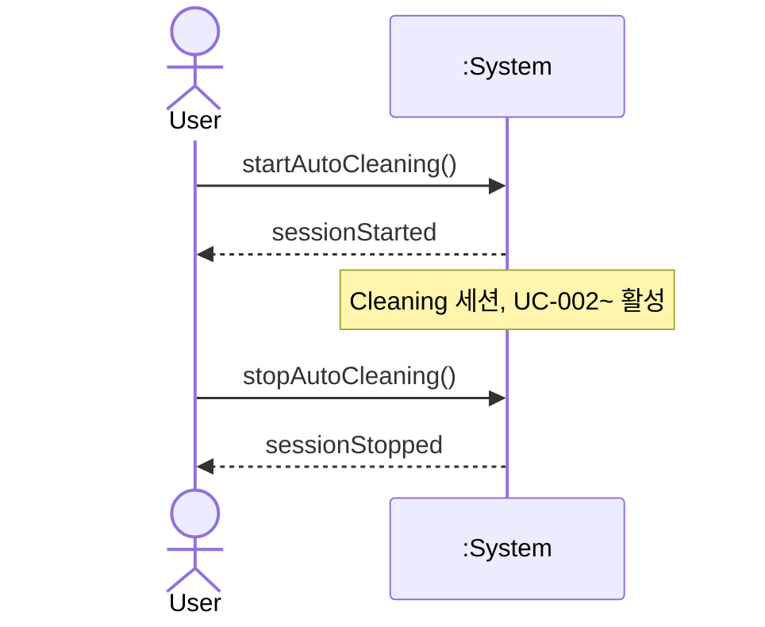

# SSD: UC-001 — Main success (*Control automatic cleaning session*)

## 전제

- 기기 **Idle**(또는 동등 대기). `UC-001` Pre-Requisites와 정합.

## 시퀀스

## 시스템 연산 요약

| 연산 | 의미 |
|------|------|
| `startAutoCleaning()` | 자동 청소 세션 시작 |
| `stopAutoCleaning()` | 세션 종료·안전 정지 |
