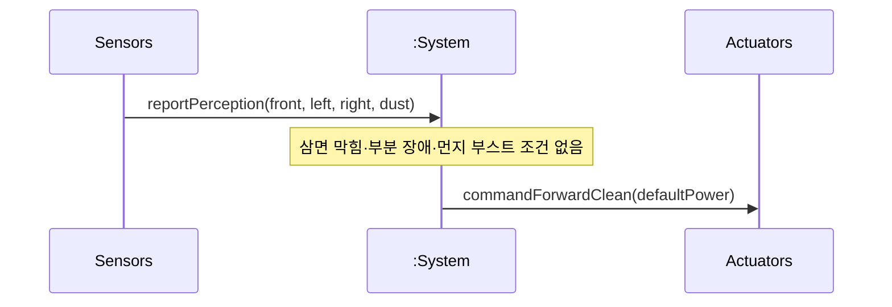

# SSD: UC-002 — Main success (*Forward cleaning while session active*, 틱 1회)

## 전제

- `UC-002` Pre-Requisites: 세션 **Cleaning**, 삼면막힘 아님, UC-003/004/005가 **이번 틱에서 우선 개입하지 않는** 경로(전형적 흐름 1–3).

## 시퀀스

## 시스템 연산 요약

| 연산 | 의미 |
|------|------|
| `reportPerception(frontBlocked, leftBlocked, rightBlocked, dust)` | 전/좌/우·먼지 스냅샸 보고(블랙박스; `UC-002` 이벤트 1) |
| `commandForwardClean(power)` | 전진+지정 파워 청소 명령(이벤트 2) |
