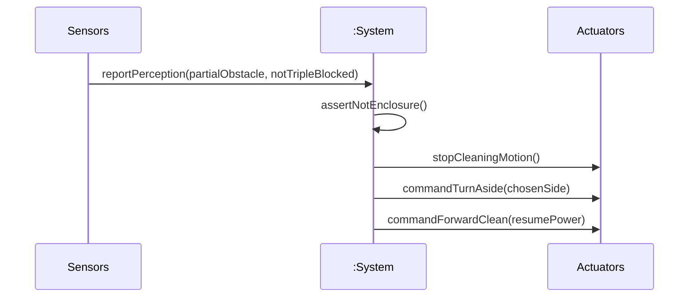

# SSD: UC-003 — Main success (*Avoid obstacle when partially blocked*)

## 전제

- `UC-003` Pre-Requisites: 세션 **Cleaning**, 삼면 동시 막힘 **아님**, 좌/우 중 회피 가능(정책).

## 시퀀스

*Typical 1–5에 대응.*

## 시스템 연산 요약

| 연산 | 의미 |
|------|------|
| `reportPerception(...)` / 부분 장애 이벤트 | 이벤트 1: 일부 방향 장애 인식 |
| *(내부)* 삼면 아님 확인 | 이벤트 2 |
| `stopCleaningMotion()` | 이벤트 3 |
| `commandTurnAside(side)` | 이벤트 4 |
| `commandForwardClean(power)` | 이벤트 5 → `UC-002` 복귀 |
