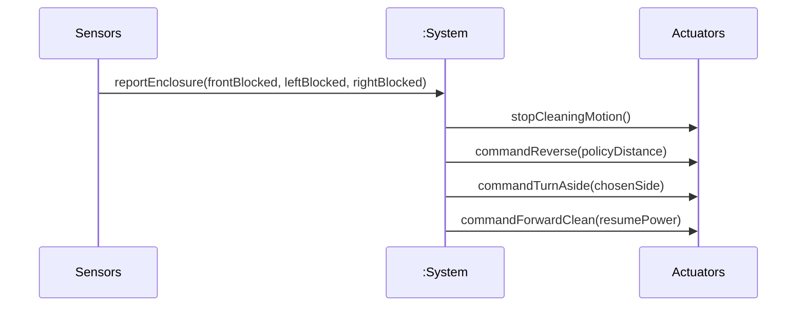

# SSD: UC-004 — Main success (*Escape when front, left, and right are blocked*)

## 전제

- `UC-004` Pre-Requisites: 세션 **Cleaning**, 전·좌·우 **동시** 막힘 보고.

## 시퀀스

*Typical 1–5에 대응.*

## 시스템 연산 요약

| 연산 | 의미 |
|------|------|
| `reportEnclosure(...)` | 이벤트 1: 삼면 막힘 |
| `stopCleaningMotion()` | 이벤트 2 |
| `commandReverse(distance)` | 이벤트 3 — 거리/시간은 정책·NFR |
| `commandTurnAside(side)` | 이벤트 4 |
| `commandForwardClean(power)` | 이벤트 5 → `UC-002` 복귀 |
