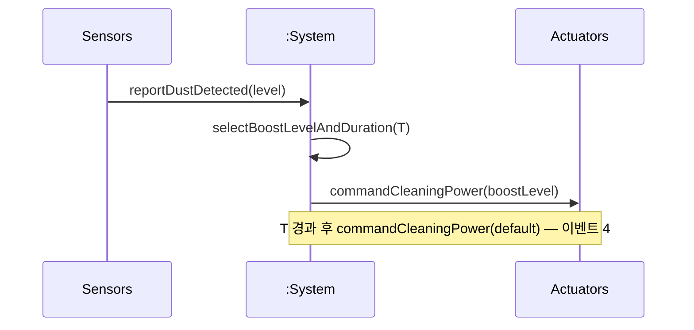

# SSD: UC-005 — Main success (*Boost cleaning power on dust detection*)

## 전제

- `UC-005` Pre-Requisites: 세션 **Cleaning**, 먼지 이벤트 가능. `A2`: 동일 틱에 회피가 있으면 **회피 우선**(본 SSD는 먼지만 다루는 경로).

## 시퀀스

*Typical 1–4(타이머 만료로 기본 파워 복귀).*

## 시스템 연산 요약

| 연산 | 의미 |
|------|------|
| `reportDustDetected(level)` | 이벤트 1 |
| *(내부)* 부스트 레벨·T 결정 | 이벤트 2 |
| `commandCleaningPower(level)` | 이벤트 3(유지)…이벤트 4에서 기본값 |
| `A1` 연장·갱신 | 단일 타이머 정책은 구현 선택 |

## 구현 매핑

- `commandCleaningPower`·T·레벨은 `ControllerConfig` + `CleaningPowerPolicy` + `IActuatorPort::set_cleaning_power` — **`arch/design/implementation-mapping.md`**.
