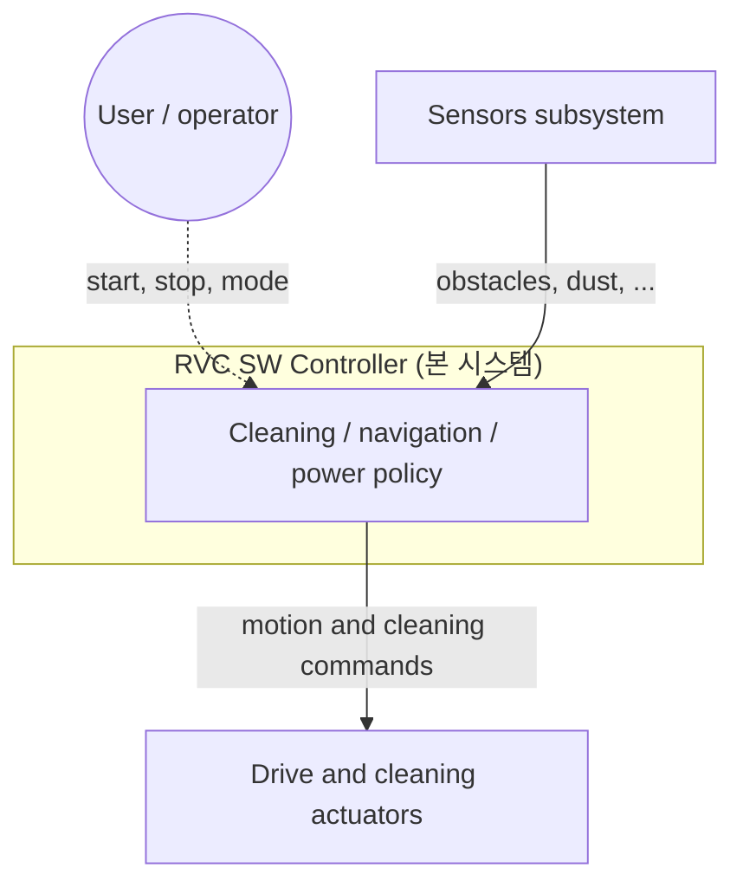

# RVC SW Controller — 시스템 정의 (`system.md`)

## 시스템 이름·한 줄 목적

- **이름**: RVC (Robotic Vacuum Cleaner) **소프트웨어 컨트롤러**
- **목적**: 가정 내 바닥을 **자동으로 청소·걸레질**하며, **장애물·먼지 등 센서 이벤트**에 따라 주행·청소 강도를 조정하는 **자동 청소 기능**을 소프트웨어로 제어한다.

## 풀고자 하는 문제

- 청소 중 **전진**을 기본으로 하되, **장애물**, **전방·좌·우 동시 막힘**, **먼지 감지** 등 상황에 따라 안전하게 **회피·후진·청소 파워 조절**을 수행할 수 있어야 한다.
- 본 문서 범위에서는 **HW 제어의 상세 설계·구현은 다루지 않으며**, 컨트롤러가 제공해야 할 **동작·맥락·경계**만 정의한다.

---

## 범위

### 포함 (In scope)

- 자동 청소·걸레질을 위한 **행동 규칙**:
  - 청소 중 **직진**
  - 센서가 **장애물**을 감지하면: 청소 **정지** → **좌 또는 우**로 비켜섬 → 다시 **전진하며 청소**
  - **전방·좌·우**에 장애물이 모두 있으면: **후진** → **좌 또는 우**로 비켜섬 → 다시 **전진하며 청소**
  - **먼지 감지** 시: **일정 기간 청소 파워(세기) 증가**
- 위 동작을 뒷받침하는 **소프트웨어 컨트롤러**의 책임·경계 (모터·센서 HW는 **블랙박스**로만 가정)

### 제외 (Out of scope)

- 모터·바퀴·센서 등 **HW 상세 설계 및 저수준 제어 구현**
- **향후/확장 요구**에 해당하는 기능의 **현행 필수 명세** (아래 «향후 확장» 참고 — 참고용만)

---

## 주요 액터·이해관계자

| 액터 / 이해관계자 | 설명 |
|------------------|------|
| **주거 사용자** | RVC 운용, 청소 환경 제공 |
| **센서 서브시스템** | 장애물·먼지 등 환경 정보 제공 (HW 디테일 비포함) |
| **구동·청소 액추에이터** | 이동·청소·걸레 동작 수행 (HW 디테일 비포함) |
| **RVC SW Controller** (본 시스템) | 센서 입력에 따른 **자동 청소 행동 결정·명령** |

---

## 시스템 경계

- **경계 내부**: 자동 청소 **정책·행동 로직** 및 이를 위한 소프트웨어 구조.
- **경계 외부**: 실제 HW, 저수준 드라이버, 향후 모바일 앱·ML 등(확장).

---

## 초기 요구사항 정리 (Preliminary)

1. RVC는 **가정 내 표면**을 자동으로 **청소·걸레질**한다.
2. 청소 중 **기본적으로 직진**한다.
3. 센서가 **장애물**을 감지하면: 청소를 멈추고, **좌 또는 우**로 비켜간 뒤, 다시 전진하며 청소한다.
4. **전방·좌·우**에 모두 장애물이 있으면: **후진**한 뒤 **좌 또는 우**로 비켜가고, 다시 전진하며 청소한다.
5. **먼지**가 감지되면: **일정 시간 동안 청소 파워를 높인다**.
6. **HW 제어의 상세 설계·구현은 고려하지 않는다.**
7. **자동 청소 기능**에만 초점을 맞춘다.

---

## 제약·가정

- HW는 **블랙박스**로 두고, 컨트롤러는 **의미 있는 센서 이벤트·제어 명령** 수준에서 기술한다.
- **좌/우/후진/파워 증가**의 구체 시간·속도·물리량은 후속 **FR/NFR·유스케이스**에서 필요 시 수치화한다.
- 과제 전역 제약(C++, GTest, CI, GUI 시스템 테스트 30+, 정적 분석 보고서 보관 등)은 **`arch/requirements/fr-nfr.md`** 에서 다루며, 여기서는 중복을 피하고 **링크·한 줄 요약**만 둔다.

---

## 향후 확장 (Future / Extended — 현 버전 필수 아님)

다음은 **로드맵 참고**이며, 현 `system.md` 범위의 **필수 요구가 아니다**.

- 센서 **추가·변경**
- **한 지점 순환** 청소
- **모바일 앱**과의 통신
- **머신러닝·추론**을 통한 청소 효율화

---

## 체크포인트 (system-definer 정렬)

- [ ] **시스템 경계** 명확 (SW 컨트롤러 vs HW·향후 앱/ML)
- [ ] **시스템 범위** 명확 (자동 청소 행동 vs HW 디테일 vs 확장 기능)
- [ ] **제약** 식별 (HW 비포함, 청소 기능 집중, `fr-nfr` 연계)
