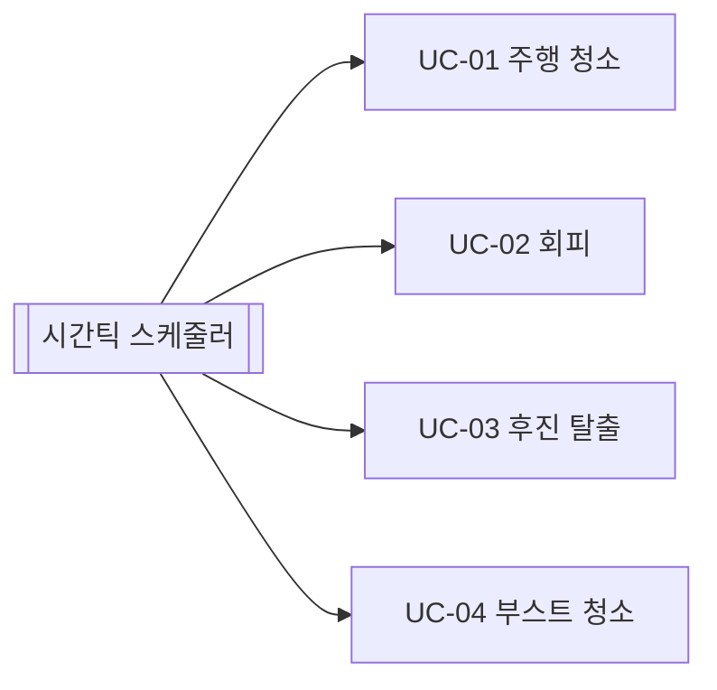

# Use Cases — RVC Control SW

## Actor

- **자동 청소 시스템(SW)**: 시간틱 스케줄러가 매 주기 `tick()`을 호출한다고 가정한다.
- **물리/하드웨어 적층**: 센서 입력을 스냅샷으로 제공하고 구동 명령을 적용한다(추상화).

## 유스케이스 목록

| ID | 이름 | 목표 |
|----|------|------|
| UC-01 | 주행하며 청소한다 | 전방이 막히지 않으면 전진하며 청소 모드를 유지한다. |
| UC-02 | 전방 장애물을 회피한다 | 전방 장애물이면 청소 중단 후 좌/우 회전 및 재전진으로 복귀한다. |
| UC-03 | 사방 포위 시 후진 탈출한다 | 전·좌·우 장애물이면 후진 후 회전·재전진으로 탈출 시도한다. |
| UC-04 | 먼지 구간을 강화 청소한다 | 먼지 감지 시 일정 틱 동안 부스트 청소 모드를 적용한다. |

## UC-01 주행하며 청소한다 (Brief)

**전제**: 시스템이 Idle→운행 상태로 들어가 있고 센서 스냅샷이 유효하다.  
**기본 흐름**: 매 틱 센서를 읽고 전방이 비었으면 전진 명령과 일반 청소 모드를 출력한다.  
**결과**: 이동 가능한 한 로봇이 공간을 탐색하며 바닥 청소 카운트가 증가한다.

## UC-02 전방 장애물을 회피한다 (Brief)

**전제**: 전방 센서가 장애물을 보고한다.  
**기본 흐름**: 청소 모드를 끄고(요구사항의 “멈춤”) 회전 기동을 수행한 뒤 전진으로 복귀한다. 좌·우가 모두 열려 있으면 **좌측 우선**(결정적 선택).  
**대안 흐름**: 한쪽만 열리면 그쪽으로 회전한다.

## UC-03 사방 포위 시 후진 탈출한다 (Brief)

**전제**: 전방·좌·우 모두 장애물이다.  
**기본 흐름**: 후진을 여러 틱 수행한 뒤 회전·전진으로 탈출을 시도한다.

## UC-04 먼지 구간을 강화 청소한다 (Brief)

**전제**: 먼지 센서가 참이다.  
**기본 흐름**: 향후 일정 틱 동안 전진 청소 시 부스트 모드를 적용한다(회피 기동 중에는 청소 모드가 꺼질 수 있음).

## 유스케이스 다이어그램 (Mermaid)

