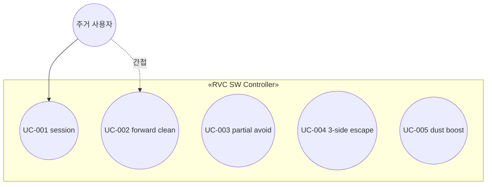

# Use Case 목록 — RVC SW Controller

## 개요

`system.md` 범위 내 **자동 청소** 기능을 유스케이스로 분해한다. HW 블랙박스 가정.

## 식별 기준

- 액터가 달성하는 **목표** 단위
- 시스템 **블랙박스** 관점(내부 클래스명·드라이버 미기술)

## 상세 명세 템플릿 (`usecase/UC-nnn.md`)

각 UC 상세 파일은 다음 **영문 절**을 포함한다: **Name**, **Actor**, **Pre-Requisites**, **Typical Courses of Events**, **Alternative Courses of Events**, **Exceptional Courses of Events**.

## Use Case 목록

| ID | 이름 (문서 Name) | 요약 | Primary Actor | 우선순위 | ASR |
|----|------------------|------|---------------|----------|-----|
| UC-001 | Control automatic cleaning session | 사용자가 자동 청소 시작·중지 | 주거 사용자 | 높음 | |
| UC-002 | Forward cleaning while session active | 세션 중 기본 전진·청소(먼지·회피와 전·후행 조합) | RVC SW Controller | 높음 | |
| UC-003 | Avoid obstacle when partially blocked | 부분 방향 장애 시 정지·좌/우 회피·재전진 | RVC SW Controller | 높음 | Y |
| UC-004 | Escape when front, left, and right are blocked | 삼면 막힘 시 후진·회피·재전진 | RVC SW Controller | 높음 | Y |
| UC-005 | Boost cleaning power on dust detection | 먼지 감지 시 T 동안 파워 상향 후 복귀 | RVC SW Controller | 중간 | Y |

## 핵심 ASR UC

- **UC-003, UC-004**: 안전·상태 분기 복잡도, 잘못된 전이 시 충돌 위험 → SSD·상호작용·테스트 깊이 확보.
- **UC-005**: 타이머·세기 정책과 주행 정책 **동시성** → 설계·단위 테스트 중요.

## Use Case 다이어그램 (스케치)

*참고: UC 상세 **Name**은 영문 전체 문장(`usecase/UC-00*.md`). 실제 실행은 세션(UC-001) 후 루프가 UC-002~005를 조합.*
